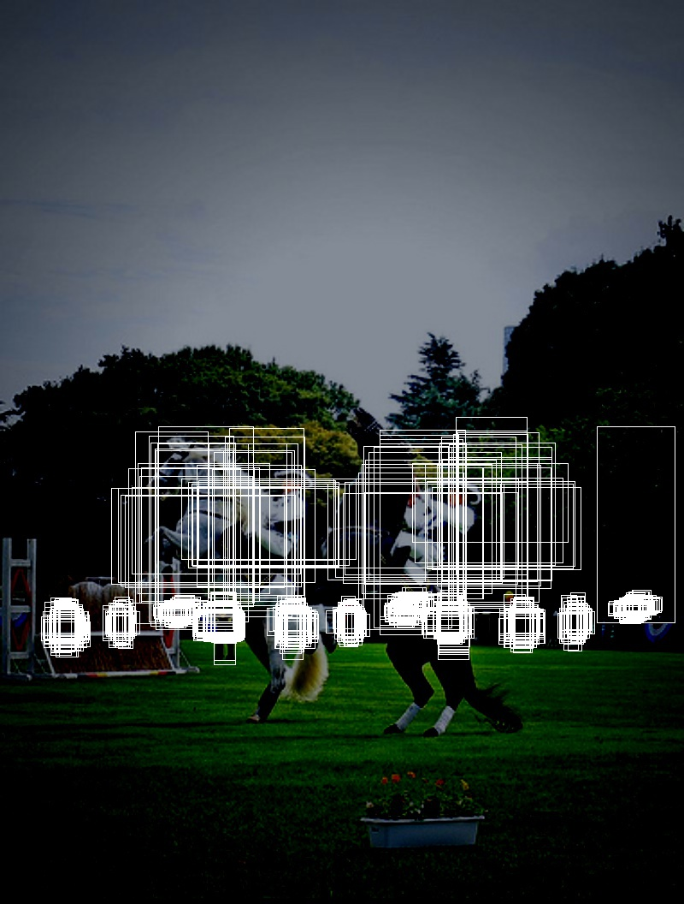
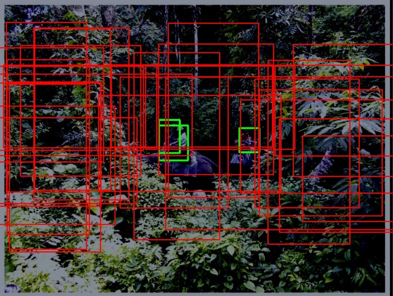

Pytorch Implementation of Mask R-CNN
======================
  

This code is an exercise code based on Mask R-CNN released in 2018.  
It was implemented for programming pracitice as part of CV Lab's freshman trianing.  
Updates per week.  
  
# Week0
 * **read papers :**    
  
  [1] Ren, Shaoqing, et al. "Faster r-cnn: Towards real-time object detection with region proposal networks." IEEE transactions on pattern analysis and machine intelligence 39.6 (2016): 1137-1149.  
  [2] Lin, Tsung-Yi, et al. "Feature pyramid networks for object detection." Proceedings of the IEEE conference on computer vision and pattern recognition. 2017.  
  [3] He, Kaiming, et al. "Mask r-cnn." Proceedings of the IEEE international conference on computer vision. 2017.  

* **Pipeline schematic design**  
  

  
  use only one gpu (not support distributed learning)   
   
  
# Week1
*  **model**  
  
  ```
  (backbone): FPN(
    (fpn_lateral2): Conv2d(256, 256, kernel_size=(1, 1), stride=(1, 1))
    (fpn_output2): Conv2d(256, 256, kernel_size=(3, 3), stride=(1, 1), padding=(1, 1))
    (fpn_lateral3): Conv2d(512, 256, kernel_size=(1, 1), stride=(1, 1))
    (fpn_output3): Conv2d(256, 256, kernel_size=(3, 3), stride=(1, 1), padding=(1, 1))
    (fpn_lateral4): Conv2d(1024, 256, kernel_size=(1, 1), stride=(1, 1))
    (fpn_output4): Conv2d(256, 256, kernel_size=(3, 3), stride=(1, 1), padding=(1, 1))
    (fpn_lateral5): Conv2d(2048, 256, kernel_size=(1, 1), stride=(1, 1))
    (fpn_output5): Conv2d(256, 256, kernel_size=(3, 3), stride=(1, 1), padding=(1, 1))
    (top_block): LastLevelMaxPool()
    (bottom_up): ResNet(
      (stem): BasicStem(
        (conv1): Conv2d(
          3, 64, kernel_size=(7, 7), stride=(2, 2), padding=(3, 3), bias=False
          (norm): FrozenBatchNorm2d(num_features=64, eps=1e-05)
        )
      )
      (res2): Sequential(
        (0): BottleneckBlock(
          (shortcut): Conv2d(
            64, 256, kernel_size=(1, 1), stride=(1, 1), bias=False
            (norm): FrozenBatchNorm2d(num_features=256, eps=1e-05)
          )
          (conv1): Conv2d(
            64, 64, kernel_size=(1, 1), stride=(1, 1), bias=False
            (norm): FrozenBatchNorm2d(num_features=64, eps=1e-05)
          )
          (conv2): Conv2d(
            64, 64, kernel_size=(3, 3), stride=(1, 1), padding=(1, 1), bias=False
            (norm): FrozenBatchNorm2d(num_features=64, eps=1e-05)
          )
          (conv3): Conv2d(
            64, 256, kernel_size=(1, 1), stride=(1, 1), bias=False
            (norm): FrozenBatchNorm2d(num_features=256, eps=1e-05)
          )
        )
        (1): BottleneckBlock(
          (conv1): Conv2d(
            256, 64, kernel_size=(1, 1), stride=(1, 1), bias=False
            (norm): FrozenBatchNorm2d(num_features=64, eps=1e-05)
          )
          (conv2): Conv2d(
            64, 64, kernel_size=(3, 3), stride=(1, 1), padding=(1, 1), bias=False
            (norm): FrozenBatchNorm2d(num_features=64, eps=1e-05)
          )
          (conv3): Conv2d(
            64, 256, kernel_size=(1, 1), stride=(1, 1), bias=False
            (norm): FrozenBatchNorm2d(num_features=256, eps=1e-05)
          )
        )
        (2): BottleneckBlock(
          (conv1): Conv2d(
            256, 64, kernel_size=(1, 1), stride=(1, 1), bias=False
            (norm): FrozenBatchNorm2d(num_features=64, eps=1e-05)
          )
          (conv2): Conv2d(
            64, 64, kernel_size=(3, 3), stride=(1, 1), padding=(1, 1), bias=False
            (norm): FrozenBatchNorm2d(num_features=64, eps=1e-05)
          )
          (conv3): Conv2d(
            64, 256, kernel_size=(1, 1), stride=(1, 1), bias=False
            (norm): FrozenBatchNorm2d(num_features=256, eps=1e-05)
          )
        )
      )
      (res3): Sequential(
        (0): BottleneckBlock(
          (shortcut): Conv2d(
            256, 512, kernel_size=(1, 1), stride=(2, 2), bias=False
            (norm): FrozenBatchNorm2d(num_features=512, eps=1e-05)
          )
          (conv1): Conv2d(
            256, 128, kernel_size=(1, 1), stride=(2, 2), bias=False
            (norm): FrozenBatchNorm2d(num_features=128, eps=1e-05)
          )
          (conv2): Conv2d(
            128, 128, kernel_size=(3, 3), stride=(1, 1), padding=(1, 1), bias=False
            (norm): FrozenBatchNorm2d(num_features=128, eps=1e-05)
          )
          (conv3): Conv2d(
            128, 512, kernel_size=(1, 1), stride=(1, 1), bias=False
            (norm): FrozenBatchNorm2d(num_features=512, eps=1e-05)
          )
        )
        (1): BottleneckBlock(
          (conv1): Conv2d(
            512, 128, kernel_size=(1, 1), stride=(1, 1), bias=False
            (norm): FrozenBatchNorm2d(num_features=128, eps=1e-05)
          )
          (conv2): Conv2d(
            128, 128, kernel_size=(3, 3), stride=(1, 1), padding=(1, 1), bias=False
            (norm): FrozenBatchNorm2d(num_features=128, eps=1e-05)
          )
          (conv3): Conv2d(
            128, 512, kernel_size=(1, 1), stride=(1, 1), bias=False
            (norm): FrozenBatchNorm2d(num_features=512, eps=1e-05)
          )
        )
        (2): BottleneckBlock(
          (conv1): Conv2d(
            512, 128, kernel_size=(1, 1), stride=(1, 1), bias=False
            (norm): FrozenBatchNorm2d(num_features=128, eps=1e-05)
          )
          (conv2): Conv2d(
            128, 128, kernel_size=(3, 3), stride=(1, 1), padding=(1, 1), bias=False
            (norm): FrozenBatchNorm2d(num_features=128, eps=1e-05)
          )
          (conv3): Conv2d(
            128, 512, kernel_size=(1, 1), stride=(1, 1), bias=False
            (norm): FrozenBatchNorm2d(num_features=512, eps=1e-05)
          )
        )
        (3): BottleneckBlock(
          (conv1): Conv2d(
            512, 128, kernel_size=(1, 1), stride=(1, 1), bias=False
            (norm): FrozenBatchNorm2d(num_features=128, eps=1e-05)
          )
          (conv2): Conv2d(
            128, 128, kernel_size=(3, 3), stride=(1, 1), padding=(1, 1), bias=False
            (norm): FrozenBatchNorm2d(num_features=128, eps=1e-05)
          )
          (conv3): Conv2d(
            128, 512, kernel_size=(1, 1), stride=(1, 1), bias=False
            (norm): FrozenBatchNorm2d(num_features=512, eps=1e-05)
          )
        )
      )
      (res4): Sequential(
        (0): BottleneckBlock(
          (shortcut): Conv2d(
            512, 1024, kernel_size=(1, 1), stride=(2, 2), bias=False
            (norm): FrozenBatchNorm2d(num_features=1024, eps=1e-05)
          )
          (conv1): Conv2d(
            512, 256, kernel_size=(1, 1), stride=(2, 2), bias=False
            (norm): FrozenBatchNorm2d(num_features=256, eps=1e-05)
          )
          (conv2): Conv2d(
            256, 256, kernel_size=(3, 3), stride=(1, 1), padding=(1, 1), bias=False
            (norm): FrozenBatchNorm2d(num_features=256, eps=1e-05)
          )
          (conv3): Conv2d(
            256, 1024, kernel_size=(1, 1), stride=(1, 1), bias=False
            (norm): FrozenBatchNorm2d(num_features=1024, eps=1e-05)
          )
        )
        (1): BottleneckBlock(
          (conv1): Conv2d(
            1024, 256, kernel_size=(1, 1), stride=(1, 1), bias=False
            (norm): FrozenBatchNorm2d(num_features=256, eps=1e-05)
          )
          (conv2): Conv2d(
            256, 256, kernel_size=(3, 3), stride=(1, 1), padding=(1, 1), bias=False
            (norm): FrozenBatchNorm2d(num_features=256, eps=1e-05)
          )
          (conv3): Conv2d(
            256, 1024, kernel_size=(1, 1), stride=(1, 1), bias=False
            (norm): FrozenBatchNorm2d(num_features=1024, eps=1e-05)
          )
        )
        (2): BottleneckBlock(
          (conv1): Conv2d(
            1024, 256, kernel_size=(1, 1), stride=(1, 1), bias=False
            (norm): FrozenBatchNorm2d(num_features=256, eps=1e-05)
          )
          (conv2): Conv2d(
            256, 256, kernel_size=(3, 3), stride=(1, 1), padding=(1, 1), bias=False
            (norm): FrozenBatchNorm2d(num_features=256, eps=1e-05)
          )
          (conv3): Conv2d(
            256, 1024, kernel_size=(1, 1), stride=(1, 1), bias=False
            (norm): FrozenBatchNorm2d(num_features=1024, eps=1e-05)
          )
        )
        (3): BottleneckBlock(
          (conv1): Conv2d(
            1024, 256, kernel_size=(1, 1), stride=(1, 1), bias=False
            (norm): FrozenBatchNorm2d(num_features=256, eps=1e-05)
          )
          (conv2): Conv2d(
            256, 256, kernel_size=(3, 3), stride=(1, 1), padding=(1, 1), bias=False
            (norm): FrozenBatchNorm2d(num_features=256, eps=1e-05)
          )
          (conv3): Conv2d(
            256, 1024, kernel_size=(1, 1), stride=(1, 1), bias=False
            (norm): FrozenBatchNorm2d(num_features=1024, eps=1e-05)
          )
        )
        (4): BottleneckBlock(
          (conv1): Conv2d(
            1024, 256, kernel_size=(1, 1), stride=(1, 1), bias=False
            (norm): FrozenBatchNorm2d(num_features=256, eps=1e-05)
          )
          (conv2): Conv2d(
            256, 256, kernel_size=(3, 3), stride=(1, 1), padding=(1, 1), bias=False
            (norm): FrozenBatchNorm2d(num_features=256, eps=1e-05)
          )
          (conv3): Conv2d(
            256, 1024, kernel_size=(1, 1), stride=(1, 1), bias=False
            (norm): FrozenBatchNorm2d(num_features=1024, eps=1e-05)
          )
        )
        (5): BottleneckBlock(
          (conv1): Conv2d(
            1024, 256, kernel_size=(1, 1), stride=(1, 1), bias=False
            (norm): FrozenBatchNorm2d(num_features=256, eps=1e-05)
          )
          (conv2): Conv2d(
            256, 256, kernel_size=(3, 3), stride=(1, 1), padding=(1, 1), bias=False
            (norm): FrozenBatchNorm2d(num_features=256, eps=1e-05)
          )
          (conv3): Conv2d(
            256, 1024, kernel_size=(1, 1), stride=(1, 1), bias=False
            (norm): FrozenBatchNorm2d(num_features=1024, eps=1e-05)
          )
        )
      )
      (res5): Sequential(
        (0): BottleneckBlock(
          (shortcut): Conv2d(
            1024, 2048, kernel_size=(1, 1), stride=(2, 2), bias=False
            (norm): FrozenBatchNorm2d(num_features=2048, eps=1e-05)
          )
          (conv1): Conv2d(
            1024, 512, kernel_size=(1, 1), stride=(2, 2), bias=False
            (norm): FrozenBatchNorm2d(num_features=512, eps=1e-05)
          )
          (conv2): Conv2d(
            512, 512, kernel_size=(3, 3), stride=(1, 1), padding=(1, 1), bias=False
            (norm): FrozenBatchNorm2d(num_features=512, eps=1e-05)
          )
          (conv3): Conv2d(
            512, 2048, kernel_size=(1, 1), stride=(1, 1), bias=False
            (norm): FrozenBatchNorm2d(num_features=2048, eps=1e-05)
          )
        )
        (1): BottleneckBlock(
          (conv1): Conv2d(
            2048, 512, kernel_size=(1, 1), stride=(1, 1), bias=False
            (norm): FrozenBatchNorm2d(num_features=512, eps=1e-05)
          )
          (conv2): Conv2d(
            512, 512, kernel_size=(3, 3), stride=(1, 1), padding=(1, 1), bias=False
            (norm): FrozenBatchNorm2d(num_features=512, eps=1e-05)
          )
          (conv3): Conv2d(
            512, 2048, kernel_size=(1, 1), stride=(1, 1), bias=False
            (norm): FrozenBatchNorm2d(num_features=2048, eps=1e-05)
          )
        )
        (2): BottleneckBlock(
          (conv1): Conv2d(
            2048, 512, kernel_size=(1, 1), stride=(1, 1), bias=False
            (norm): FrozenBatchNorm2d(num_features=512, eps=1e-05)
          )
          (conv2): Conv2d(
            512, 512, kernel_size=(3, 3), stride=(1, 1), padding=(1, 1), bias=False
            (norm): FrozenBatchNorm2d(num_features=512, eps=1e-05)
          )
          (conv3): Conv2d(
            512, 2048, kernel_size=(1, 1), stride=(1, 1), bias=False
            (norm): FrozenBatchNorm2d(num_features=2048, eps=1e-05)
          )
        )
      )
    )
  )
  (proposal_generator): RPN(
    (rpn_head): StandardRPNHead(
      (conv): Conv2d(256, 256, kernel_size=(3, 3), stride=(1, 1), padding=(1, 1))
      (objectness_logits): Conv2d(256, 3, kernel_size=(1, 1), stride=(1, 1))
      (anchor_deltas): Conv2d(256, 12, kernel_size=(1, 1), stride=(1, 1))
    )
    (anchor_generator): DefaultAnchorGenerator(
      (cell_anchors): BufferList()
    )
  )
  (roi_heads): StandardROIHeads(
    (box_pooler): ROIPooler(
      (level_poolers): ModuleList(
        (0): ROIAlign(output_size=(7, 7), spatial_scale=0.25, sampling_ratio=0, aligned=True)
        (1): ROIAlign(output_size=(7, 7), spatial_scale=0.125, sampling_ratio=0, aligned=True)
        (2): ROIAlign(output_size=(7, 7), spatial_scale=0.0625, sampling_ratio=0, aligned=True)
        (3): ROIAlign(output_size=(7, 7), spatial_scale=0.03125, sampling_ratio=0, aligned=True)
      )
    )
    (box_head): FastRCNNConvFCHead(
      (flatten): Flatten(start_dim=1, end_dim=-1)
      (fc1): Linear(in_features=12544, out_features=1024, bias=True)
      (fc_relu1): ReLU()
      (fc2): Linear(in_features=1024, out_features=1024, bias=True)
      (fc_relu2): ReLU()
    )
    (box_predictor): FastRCNNOutputLayers(
      (cls_score): Linear(in_features=1024, out_features=2, bias=True)
      (bbox_pred): Linear(in_features=1024, out_features=4, bias=True)
    )
    (keypoint_pooler): ROIPooler(
      (level_poolers): ModuleList(
        (0): ROIAlign(output_size=(14, 14), spatial_scale=0.25, sampling_ratio=0, aligned=True)
        (1): ROIAlign(output_size=(14, 14), spatial_scale=0.125, sampling_ratio=0, aligned=True)
        (2): ROIAlign(output_size=(14, 14), spatial_scale=0.0625, sampling_ratio=0, aligned=True)
        (3): ROIAlign(output_size=(14, 14), spatial_scale=0.03125, sampling_ratio=0, aligned=True)
      )
    )
    (keypoint_head): KRCNNConvDeconvUpsampleHead(
      (conv_fcn1): Conv2d(256, 512, kernel_size=(3, 3), stride=(1, 1), padding=(1, 1))
      (conv_fcn_relu1): ReLU()
      (conv_fcn2): Conv2d(512, 512, kernel_size=(3, 3), stride=(1, 1), padding=(1, 1))
      (conv_fcn_relu2): ReLU()
      (conv_fcn3): Conv2d(512, 512, kernel_size=(3, 3), stride=(1, 1), padding=(1, 1))
      (conv_fcn_relu3): ReLU()
      (conv_fcn4): Conv2d(512, 512, kernel_size=(3, 3), stride=(1, 1), padding=(1, 1))
      (conv_fcn_relu4): ReLU()
      (conv_fcn5): Conv2d(512, 512, kernel_size=(3, 3), stride=(1, 1), padding=(1, 1))
      (conv_fcn_relu5): ReLU()
      (conv_fcn6): Conv2d(512, 512, kernel_size=(3, 3), stride=(1, 1), padding=(1, 1))
      (conv_fcn_relu6): ReLU()
      (conv_fcn7): Conv2d(512, 512, kernel_size=(3, 3), stride=(1, 1), padding=(1, 1))
      (conv_fcn_relu7): ReLU()
      (conv_fcn8): Conv2d(512, 512, kernel_size=(3, 3), stride=(1, 1), padding=(1, 1))
      (conv_fcn_relu8): ReLU()
      (score_lowres): ConvTranspose2d(512, 17, kernel_size=(4, 4), stride=(2, 2), padding=(1, 1))
    )
  ```

* **Implement dataloader**  
  
  Raw image / pre-processed image

  
  
  
* **Implement FPN**  
  
  Pretrained resnet50 (https://github.com/pytorch/vision/blob/master/torchvision/models/resnet.py)  
  Top down network - implemented  
    -> pretrained? (https://github.com/pytorch/vision/blob/master/torchvision/models/detection/backbone_utils.py)  
  
  
* **Implement anchor generator**  
  
  At one pixel (5 scales, 3 ratios)

  

  

* **Implement RPN head**  
  
* **Label and Sample anchors**

  

  
-- Question  
  1) how to compose batch  
  2) compare with pretrained FPN?  
  3) compose train dataset : remove data not include person?

  
# Week2
- TODO  
  1) remove non human class image       - OK!
  2) construct loss function            - OK!
  3) implement region proposal (test)   - OK!
  4) set batch size = 2                 - ing...


* **Improve speed of RPN (anchor generator)**  
  parallelize algorithm
  
* **Model save/load function**    
  
* **Separate anchor function part**  

* **Pre NMS function**

* **Box validation check function**

* **Post NMS function**

* **delta 부분은 학습이 잘 이루어지는 것을 확인할 수 있었는데, score 부분이 학습이 잘 이루어지지 않음**  

  -> gt labeling 부분을 다시 debugging 해야할 듯함  
  -> 분명 negative anchor로 score를 0으로 학습되어야 하는 부분인데 score가 1에 가깝게 학습이 되고 있음  

  -> detectron2 코드와 비교한 결과, relu function을 사용하지 않았음 : 그래도 잘 안됨


  1개의 image로만 학습시켜도 여러 부분이 activation됨

  

  또한, 10개의 image로 학습시켰을 때, 아래처럼 작은 object에 대해 아예 추정못하는 것을 볼 수 있음

  

  -> FPN feature level과 anchor level이 matching되지 않았나?  : 문제 없음


  무엇이 문제인가?    
  1) 1개의 image로 학습하지 말고 (overflow?) 전체로 1 epoch 돌려서 결과 확인해보자 (64115 images) (0119) 
    -> 60k iter. 돌려도 제대로 된 결과가 나오지 않음 -> bug 존재한다는 거 확인
  2) detectron training 버전을 한번 넣어보자!  (나중에 해보자) : bug 확인해서 지금 바로 할 필요가 없어짐
  

* **Check losses - use Tensorboard**

  

  
* **Fix bugs**

  Checked that there is a dimension matching error in RPN Network.  
  Found out that his affected the above errors.

  -> 오류 수정후 1 epoch 돌리니 어느 정도 학습 결과가 보임.

  Top 100 proposals after 10k iters training.  

  

  (0120) change loss functions : F.cross_entropy -> F.binary_cross_entropy_with_logits
  (0120) 무조건 256 sample 뽑는 것에서, positive ratio를 유지하는 방법으로 변경

  Top 50 proposals after 120k iters training. 

  

-- Question  
  1) how to set learning rate scheduler
  2) how to debug network? debug priority?


# Week3
- TODO  
  1) set batch size = 2                           - OK!
  2) training RPN network at various parameters   - OK!
  3) Implement ROI Align layer                    - OK!
  4) Implement Fast-RCNN network                  - OK!
  5) Implement NMS algorithm(?)
  6) speed up network


* **Complete RPN Network**  
  But, Algorithm is too heavy!  
  -> RPN algorithm의 for문이 너무 많은 것 같음 (특히 batch, level 관련)
  -> 나중에 time tracking 해보고, 어디서 시간 많이 잡아먹는지 분석, 개선 해나가자.

  Batch size = 2로, epoch = 2 이후의 학습 결과 :  

  

* **Implement check ROI level**

* **RoI Align layer**
  RoI align을 for문 없이 병렬적으로 하는 방법 고려 해보자.
  -> how ?  
  -> 그냥 for문으로 하기로 함  
  Ref : https://kaushikpatnaik.github.io/annotated/papers/2020/07/04/ROI-Pool-and-Align-Pytorch-Implementation.html


  -> (0125) roi align은 구현된듯  
  모든 proposal 계산한뒤 fc에 feed할려고 했는데,  
  2000개 정도 proposal을 계산하고 보관하다 보니 out of memory가 남  
  ==> align하고 바로 fc에 feed해야할듯 -> align을 2000번 반복
  -> 다시 코드 수정

  -> labeling을 먼저 구현해야한다는 것을 깨달음 
  1) proposal에 gt box 추가
  2) labeling 기준 정하기 -> detectron2에는 iou threshold = 0.5 기준
  3) sampling
    
  
  * **Label and Sample proposals**  
  
  sampling nubmer = 256  -> 논문에서는 512이지만 gpu memory 문제로 인해 256로 변경  
      (나중에 메모리 최적화 하여 512로 수정할 것임)
  positive ratio = 0.25   
  
    
  
  * **Implement Fast RCNN layers**  

  * **Match prediction - gt data**
  
  * **Implement loss function**

  * **Train entire model**  
  -> train RPN 1 epoch, entire 1 epoch.

  (0127) 학습 중간에 자꾸 에러 남. argument error하기는 하는데, 어느 부분에서 문제가 있는지 몰라서,  
  문제가 되는 index를 다시 뽑아서 원인 파악하고자 함
  
  학습 중간에 error남 : proposal이 0개 뽑혀서 그런지 확인

  =>  
  RuntimeError : There were no tensor arguments to this function (e.g. you passed an empty list of Tensors,) but no fallback function is registered for schema aten::_cat. This usually means that this function requires a non-empty list of Tensors. 

  -> proposal은 무조건 1이상으로 설정해뒀는데 왜 그런지 확인해봐야겠음.  
  -> sampling의 문제인가?  
  -> 학습 중간에 생기는 것이기 때문에 debugging에 시간 많이 소요

  =>
  RuntimeError: adaptive_max_pool2d_cuda(): expected input to have non-empty spatial dimensions, but input has sizes [1, 256, 0, 7] with dimension 2 being empty

  -> proposal 넣기 전에 valid check를 한번 더 함.


  * **During training FastRCNN part, freeze backbone & RPN**

  -> ROIAlign 부분에 문제가 있는 것 같음 : 연결하면 학습이 안됨  

  -> bilinear interpolate시에 x, y좌표를 계산하는 과정에서 이 부분에 loss가 흘러가서 문제가 된듯  
  -> .detach()를 통해 해결... 학습 하여 확인해보자.


  RPN 2 epoch training -> Entire network 2500 iters   
  Final Result : 

  

  RPN 2 epoch training, Entire network 1 epoch  
  Result :  

  


  When train entire network, change in backbone network  
  so, RPN network's performance is lowered.  

  =>  
  1) Adpative learning : RPN -> Entire -> RPN -> Entire  -> ...
  2) Loss merge learning : RPN + Entire


-- Question  
  1) how to save/load part of model?
  2) RoI align을 debugging하기가 어려움. 
    -> RoI align이 잘되는 건지, 아니면 잘못된 RoI align layer가 출력하는 패턴을 보고 classifier가 분류하는건지,
    -> 평가지표를 통해 성능 측정함으로써 확인해봐야할듯
    

# Week4
- TODO  
  1) Implement Evaluation code.
  2) Speed up network
  3) Code cleanup

  
  결과를 확인하는데 오래걸려 training dataset 30000 images로 제한

  학습시간 개선 필요  
  -> 대부분의 시간이 RoI Align를 통한 forward, backward에서 시간이 걸림  
  원래는 RoI align sampling을 dense하게 했는데 일정한 수로 sampling하는 방법으로 변경 예정 (i.g. sampling : 2)

  
* **Train a model with good performance**  


  

  RPN training 1 epoch -> entire network training 1 epoch  한 결과  

  작은 물체, 여러개의 물체에 대해 좋은 detection이 이루어짐.    

  -> 문제점 : 이제는 큰 물체에 대해 여러 번의 detection이 이루어짐.  
  그렇다고 nms threshold를 올리면 작은 물체 여러개 겹쳐있을 때 detection을 하지 않음.    
  
  예상 해결점 : 
  1) proposal labeling threshold를 올리자.  
  2) coordiante predict가 약한거 같으니, 이 부분 loss의 가중치를 올리자.  

* **Add test code**  

* **Convert json format**  

* **Evaluate Results**  
  Use coco API   

  생각보다 평가 지표가 낮게 나옴  
  -> xywh 형식으로 바꿔야하는데 xyxy 형식으로 출력하고 있었음  


  Results :   
  
  Average Precision  (AP) @[ IoU=0.50:0.95 | area=   all | maxDets=100 ] = 0.254  
  Average Precision  (AP) @[ IoU=0.50      | area=   all | maxDets=100 ] = 0.563  
  Average Precision  (AP) @[ IoU=0.75      | area=   all | maxDets=100 ] = 0.199  
  Average Precision  (AP) @[ IoU=0.50:0.95 | area= small | maxDets=100 ] = 0.086  
  Average Precision  (AP) @[ IoU=0.50:0.95 | area=medium | maxDets=100 ] = 0.309  
  Average Precision  (AP) @[ IoU=0.50:0.95 | area= large | maxDets=100 ] = 0.441  
  Average Recall     (AR) @[ IoU=0.50:0.95 | area=   all | maxDets=  1 ] = 0.119  
  Average Recall     (AR) @[ IoU=0.50:0.95 | area=   all | maxDets= 10 ] = 0.315  
  Average Recall     (AR) @[ IoU=0.50:0.95 | area=   all | maxDets=100 ] = 0.346  
  Average Recall     (AR) @[ IoU=0.50:0.95 | area= small | maxDets=100 ] = 0.152   
  Average Recall     (AR) @[ IoU=0.50:0.95 | area=medium | maxDets=100 ] = 0.419  
  Average Recall     (AR) @[ IoU=0.50:0.95 | area= large | maxDets=100 ] = 0.554  

  -> Detectron2 보다 성능이 매우 낮음  (detectron2 : 0.536)  
  --> 목표 : 적어도 AP = 0.45 까지는 올리는게 목표  

-- Question  
  1) 모델 성능 높이기 위한 우선 순위  
  : hyper parameter 무엇을 먼저 바꿔야하는가?  